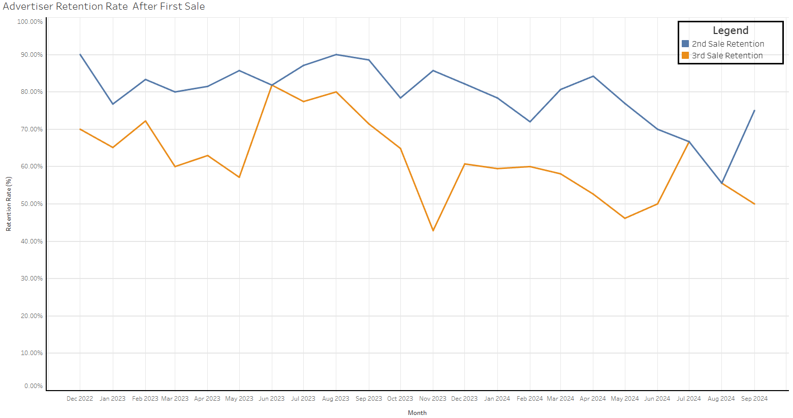

# _**Click image to view full slide deck (7 Slides)**_
  

# Analyzing Advertiser Retention After First Sale

## Summary
Conducted a data-driven analysis of new advertiser churn for a $1.5M revenue stream. By performing a deep-dive into user behavior, I identified exactly when and why advertisers were leaving the platform.

## Key Highlights
**Problem:**  
- The platform was seeing a drop-off in active advertisers, but leadership didn't know the specific "pain point" where users were losing interest.

**The Solution:**  
- I used SQL to perform a Cohort Analysis, grouping advertisers by their first sale date and tracking the rate that they were completing a timely second and third sale.

**The Result:**  
- Provided leadership with a clear target for intervention. By identifying the 28-day mark as the critical retention window, the team could focus resources on keeping advertisers engaged during that first period.

## Files
- [SQL Query – Retention Logic](retention_analysis.sql)  
- [View Interactive Tableau Dashboard](https://public.tableau.com/app/profile/lukas.ishihara/viz/AdvertiserRetentionRateAfterFirstSale/Dashboard1)
